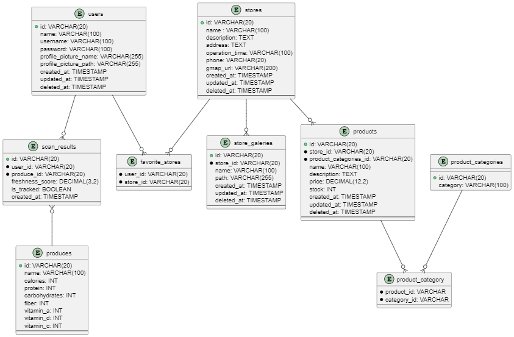

# Fresh Guard Back-End
Back-End aplication for integrating Android and Web Aplication with model machine learning for assess freshness of fruits & vegetables. And provide additional various features.

## API Documentaion
For the API documentaion you can access this link:
* [Authentication API](http://35.219.27.170/docs/api/v1/auth)
* [User Profile API](http://35.219.27.170/docs/api/v1/user)
* [Scan API](http://35.219.27.170/docs/api/v1/scan)
* [Store API](http://35.219.27.170/docs/api/v1/store)

If the links above no longer available you can clone this project to tour local computer then open the html files in folder `docs/api/html/`

## Instalation
1. Requirements <br>
This project was built and devloped using Laravel 11 with octane frankenphp, so need these things running perfectly :
    * PHP >= 8.2
    * Octane (FrankenPHP)
    * RDBMS such as: MySQL and Postgre
    * Composer
    * NodeJS & NPM
1. Commands <br>
1. Commands <br>
To run the aplication you can use these commands:
```bash
git clone https://github.com/C242-PS431/fresh-guard-backend
composer install
composer run post-root-package-install
php artisan octane:install --server frankenphp
php artisan migrate
npm install
npm run build
php artisan octane:start --server frankenphp
```
> Note: if don't wanna run the web you don't have to install NodeJS & NPM and you can skip npm commands

## Database Design (ERD)

## Tech Stack
1. Programming language
    * PHP
    * Javascript
1. Framework and libraries
    * Laravel
    * FrankenPHP
    * hidehalo/nanoid
    * spatie/laravel-google-cloud-storage
    * axios
1. Database and storage
    * MySQL
    * Cloud Storage
1. Dev tools
    * Composer
    * npm
    * NodeJS
    * vite